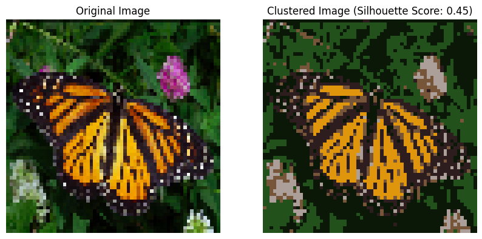

# Ratio Cut and K-Means Clustering for Image Segmentation

## Overview

This project demonstrates image segmentation using two clustering techniques: **Ratio Cut Clustering** and **K-Means Clustering**. The assignment involves implementing both techniques on resized images, evaluating their effectiveness for clustering with different cluster counts (3 and 6), and comparing their performance using **Silhouette Scores**.

## Table of Contents

- [Objective](#objective)
- [Clustering Techniques](#clustering-techniques)
  - [Ratio Cut Clustering](#ratio-cut-clustering)
  - [K-Means Clustering](#k-means-clustering)
- [Results](#results)
- [How to Use](#how-to-use)

## Objective

The assignment aims to:
1. Implement the Ratio Cut clustering method for image segmentation.
2. Apply K-Means clustering and compare its results with Ratio Cut on the same images.

Both techniques are performed on images resized to a fixed dimension of 64x64x3 to reduce memory consumption and improve computational efficiency.

## Clustering Techniques

### 1. Ratio Cut Clustering

The steps involved in Ratio Cut Clustering are as follows:

1. **Construct Similarity Graph**: Compute pairwise similarity between pixels using a Gaussian kernel, creating an adjacency matrix \( W \) representing pixel similarities.
2. **Degree Matrix \( D \)**: Construct a degree matrix where each diagonal element represents the sum of connections (weights) for each vertex.
3. **Laplacian Matrix**: Calculate the Laplacian matrix \( L = D - W \).
4. **Eigenvalues and Eigenvectors**: Compute eigenvalues and eigenvectors of \( L \) and select those corresponding to the smallest \( k \) eigenvalues.
5. **Cluster Eigen Vectors Using K-Means**: Apply K-means to the selected eigenvectors to form \( k \) clusters.
6. **Compute Silhouette Score**: Evaluate the quality of clusters using the Silhouette Score, which reflects intra-cluster cohesion and inter-cluster separation.

### 2. K-Means Clustering

Steps followed for K-Means Clustering:

1. **Random Initialization of Centroids**: Select \( k \) random points as initial centroids.
2. **Assign Data Points to Nearest Centroid**: Allocate each pixel to the closest centroid using Euclidean distance.
3. **Update Centroids**: Calculate the new centroid of each cluster by averaging its pixels.
4. **Repeat Until Convergence**: Continue reassigning points and updating centroids until they stabilize.
5. **Compute Silhouette Score**: Measure clustering performance with the Silhouette Score for each cluster count.

## Results

The comparison of Silhouette Scores for both clustering techniques across two images with cluster counts 3 and 6:

| Method       | Clusters | Image 1 Score | Image 2 Score |
|--------------|----------|---------------|---------------|
| **Ratio Cut** | 3        | 0.57          | 0.53          |
| **Ratio Cut** | 6        | 0.45          | 0.25          |
| **K-Means**   | 3        | 0.45          | 0.60          |
| **K-Means**   | 6        | 0.45          | 0.53          |

You can view all the resulting images in results directory.

## How to Use

1. **Image Preprocessing**: Resize images to 64x64x3 before applying clustering algorithms.
2. **Execute Code**: Use the provided links to open and run the code in Google Colab.
3. **Analyze Results**: Use the Silhouette Scores to compare the clustering quality of each method and determine the most effective technique for your dataset.

---

